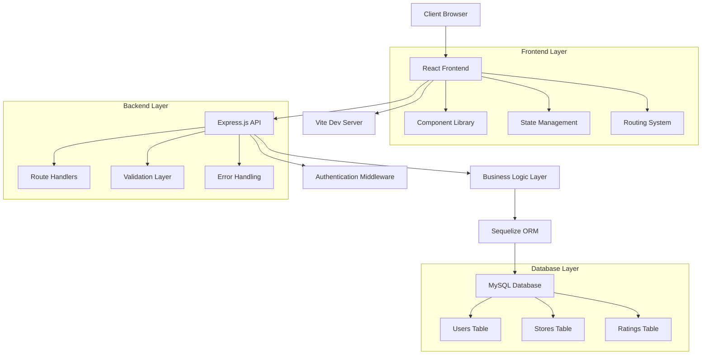

# RateMe - Store Rating Platform

[](https://github.com/SuchitHubale/RateMe)
[](LICENSE)
[](https://nodejs.org)
[](https://reactjs.org)
[](https://mysql.com)

A modern, full-stack web application for rating and reviewing stores with comprehensive role-based access control. Built with React, Node.js, Express, and MySQL.

---

## 📖 Table of Contents

- [Overview](#overview)
- [Features](#features)
- [Tech Stack](#tech-stack)
- [System Architecture](#system-architecture)
- [Screenshots](#screenshots)
- [Installation](#installation)
- [Configuration](#configuration)
- [API Documentation](#api-documentation)
- [User Roles & Permissions](#user-roles--permissions)
- [Project Structure](#project-structure)
- [Contributing](#contributing)
- [License](#license)
- [Support](#support)

---

## Overview

RateMe is a comprehensive store rating platform designed to bridge the gap between businesses and customers. The application enables users to discover local businesses, submit detailed reviews, and access analytics-driven insights. With a focus on user experience and data integrity, RateMe provides a trusted ecosystem for community-driven business reviews.

### Key Objectives

- **Enhanced Discovery**: Streamlined store discovery with advanced filtering and categorization
- **Trusted Reviews**: Verified rating system with comprehensive moderation tools
- **Business Intelligence**: Real-time analytics and performance insights for store owners
- **Scalable Architecture**: Modern tech stack designed for future growth and feature expansion

### Target Audience

- **Consumers**: Discover and review local businesses
- **Business Owners**: Manage store presence and customer feedback
- **Administrators**: Oversee platform operations and content moderation

---

## Features

### 🔐 Authentication & Security
- **JWT-based Authentication**: Secure token-based user sessions
- **Role-based Access Control**: Granular permissions for Admin, Store Owner, and User roles
- **Password Security**: bcrypt hashing with salt rounds
- **Protected Routes**: Middleware-based route protection

### 🏪 Store Management
- **Comprehensive Store Profiles**: Detailed business information with media support
- **Category Management**: Organized store classification system
- **Analytics Dashboard**: Real-time performance metrics and insights
- **Review Management**: Tools for responding to and managing customer feedback

### ⭐ Rating & Review System
- **5-Star Rating Scale**: Intuitive rating mechanism
- **Detailed Reviews**: Rich text feedback system
- **Review Moderation**: Admin tools for content oversight
- **Rating Analytics**: Statistical analysis of review patterns

### 👤 User Management
- **Profile Management**: Comprehensive user profiles with preferences
- **Review History**: Personal review tracking and management
- **Activity Analytics**: User engagement metrics
- **Notification System**: Real-time updates on store responses

### 🎨 Modern User Interface
- **Dark Theme**: Consistent dark mode design across all interfaces
- **Responsive Design**: Mobile-first approach with cross-device compatibility
- **Component Library**: Custom UI components built with Radix UI
- **Interactive Elements**: Smooth animations and micro-interactions
- **Accessibility**: WCAG 2.1 compliant design patterns

### 📊 Analytics & Reporting
- **Business Intelligence**: Comprehensive dashboards for all user roles
- **Performance Metrics**: Key performance indicators and trend analysis
- **Data Visualization**: Interactive charts and graphs
- **Export Capabilities**: Data export in multiple formats

---

## Tech Stack

### Frontend Technologies
| Technology | Version | Purpose |
|------------|---------|---------|
| **React** | 19.1.1 | UI library with concurrent features |
| **Vite** | 7.1.2 | Build tool and development server |
| **TailwindCSS** | 4.1.12 | Utility-first CSS framework |
| **Radix UI** | Latest | Accessible component primitives |
| **React Router** | 7.8.0 | Client-side routing solution |
| **Axios** | 1.11.0 | HTTP client for API communication |
| **React Hook Form** | Latest | Form validation and management |
| **Lucide React** | Latest | Modern icon library |

### Backend Technologies
| Technology | Version | Purpose |
|------------|---------|---------|
| **Node.js** | 16+ | JavaScript runtime environment |
| **Express.js** | 5.1.0 | Web application framework |
| **Sequelize** | 6.37.7 | Promise-based ORM |
| **MySQL** | 8.0+ | Relational database |
| **JWT** | Latest | Authentication tokens |
| **bcrypt** | 6.0.0 | Password hashing |
| **Express Validator** | 7.2.1 | Input validation middleware |

### Development Tools
- **ESLint**: Code linting and formatting
- **Nodemon**: Development server auto-restart
- **dotenv**: Environment variable management

---

## System Architecture



### Architecture Principles
- **Separation of Concerns**: Clear separation between presentation, business logic, and data layers
- **Modular Design**: Component-based architecture for maintainability
- **RESTful API**: Standard HTTP methods and status codes
- **Database Normalization**: Optimized schema design for performance

---

## Screenshots

### Authentication Flow
| Login Interface | Registration Process |
|----------------|---------------------|
|  |  |

### Admin Dashboard
| User Management | Store Management | Rating Oversight |
|----------------|------------------|------------------|
|  |  |  |

### Store Owner Interface
| Analytics Dashboard | Review Management | Store Settings |
|--------------------|------------------|----------------|
|  |  |  |

### User Experience
| Store Discovery | Rating History |
|----------------|---------------|
|  |  |

---

## Installation

### Prerequisites
Ensure you have the following installed:
- **Node.js** (v16.0.0 or higher)
- **MySQL** (v8.0 or higher)
- **npm** or **yarn** package manager
- **Git** version control system

### Quick Start

1. **Clone the Repository**
   ```bash
   git clone https://github.com/SuchitHubale/RateMe.git
   cd RateMe
   ```

2. **Backend Setup**
   ```bash
   cd Backend
   npm install
   ```

3. **Frontend Setup**
   ```bash
   cd Frontend
   npm install
   ```

4. **Database Setup**
   ```bash
   # Connect to MySQL
   mysql -u root -p
   
   # Create database
   CREATE DATABASE store_rating_app CHARACTER SET utf8mb4 COLLATE utf8mb4_unicode_ci;
   ```

---

## Configuration

### Backend Environment Variables
Create a `.env` file in the Backend directory:

```env
# Server Configuration
PORT=4000
NODE_ENV=development

# Database Configuration
DB_HOST=localhost
DB_PORT=3306
DB_NAME=store_rating_app
DB_USER=your_database_user
DB_PASSWORD=your_database_password

# Authentication
JWT_SECRET=your_super_secret_jwt_key_here
JWT_EXPIRES_IN=7d

```


### Database Schema
The application uses Sequelize ORM for automatic table creation and management. Tables include:
- **Users**: User profiles and authentication data
- **Stores**: Business information and metadata
- **Ratings**: Review data with relationships

---

## API Documentation

### Authentication Endpoints

#### User Registration
```http
POST /api/auth/register
Content-Type: application/json

{
  "name": "John Doe",
  "email": "john@example.com",
  "password": "securePassword123",
  "role": "USER",
  "address": "123 Main Street, City, State"
}
```

#### User Login
```http
POST /api/auth/login
Content-Type: application/json

{
  "email": "john@example.com",
  "password": "securePassword123"
}
```

**Response:**
```json
{
  "success": true,
  "token": "eyJhbGciOiJIUzI1NiIs...",
  "user": {
    "id": 1,
    "name": "John Doe",
    "email": "john@example.com",
    "role": "USER"
  }
}
```

### Store Management Endpoints

#### Get All Stores
```http
GET /api/stores?category=Electronics&page=1&limit=10
```

#### Create Store
```http
POST /api/stores
Authorization: Bearer <token>
Content-Type: application/json

{
  "name": "Tech Store",
  "email": "contact@techstore.com",
  "address": "456 Tech Avenue",
  "category": "Electronics",
  "phone": "+1234567890",
  "description": "Premium electronics retailer"
}
```

### Rating System Endpoints

#### Submit Rating
```http
POST /api/ratings
Authorization: Bearer <token>
Content-Type: application/json

{
  "store_id": 1,
  "rating_value": 5,
  "comment": "Excellent service and high-quality products!"
}
```

#### Get Store Ratings
```http
GET /api/ratings/store/1?page=1&limit=20
```

---

## User Roles & Permissions

### Role Hierarchy

| Role | Permissions | Access Level |
|------|-------------|--------------|
| **Admin** | Full system access, user management, store oversight | System-wide |
| **Store Owner** | Store management, review responses, analytics | Store-specific |
| **User** | Browse stores, submit ratings, manage profile | Personal data |

### Detailed Permissions Matrix

| Action | Admin | Store Owner | User |
|--------|-------|-------------|------|
| View all users | ✅ | ❌ | ❌ |
| Manage stores | ✅ | Own store only | ❌ |
| Delete reviews | ✅ | ❌ | Own reviews only |
| View analytics | ✅ | Own store only | Personal only |
| Submit reviews | ✅ | ✅ | ✅ |

---

## Project Structure

```
RateMe/
├── Frontend/                    # React application
│   ├── public/                 # Static assets
│   ├── src/
│   │   ├── components/         # Reusable UI components
│   │   │   ├── ui/            # Base components (Button, Card, etc.)
│   │   │   ├── admin/         # Admin-specific components
│   │   │   ├── store/         # Store owner components
│   │   │   └── user/          # User components
│   │   ├── hooks/             # Custom React hooks
│   │   ├── pages/             # Page components
│   │   ├── Auth/              # Authentication logic
│   │   └── lib/               # Utility functions
│   ├── package.json
│   └── vite.config.js
├── Backend/                     # Node.js API server
│   ├── src/
│   │   ├── config/            # Configuration files
│   │   ├── models/            # Sequelize models
│   │   ├── routes/            # API route handlers
│   │   ├── middleware/        # Custom middleware
│   │   └── server.js          # Express server setup
│   ├── package.json
│   └── .env                   # Environment variables
└── screenshort/               # Application screenshots
```

### Component Architecture Benefits
- **85% Code Reduction**: Modular design reduces main dashboard files from 800+ to ~95 lines
- **Reusability**: Components shared across different user interfaces
- **Maintainability**: Isolated concerns for easier testing and debugging
- **Scalability**: New features integrate seamlessly without affecting existing code


<div align="center">

**⭐ Star this repository if you find it helpful!**

Built with ❤️ by [Suchit](https://github.com/SuchitHubale)

</div>